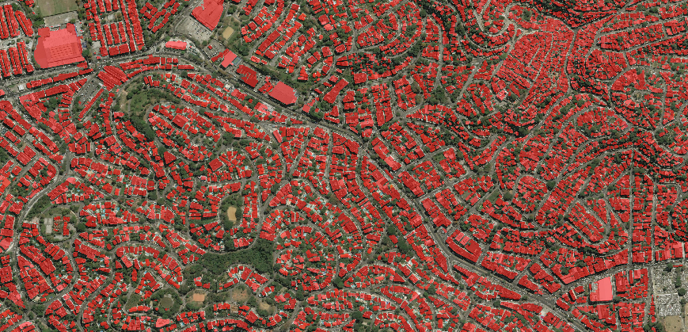
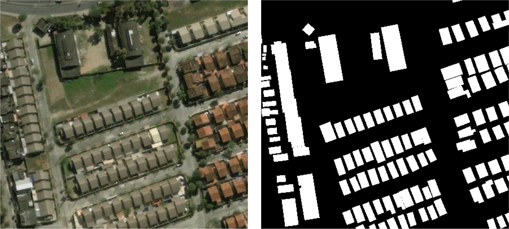
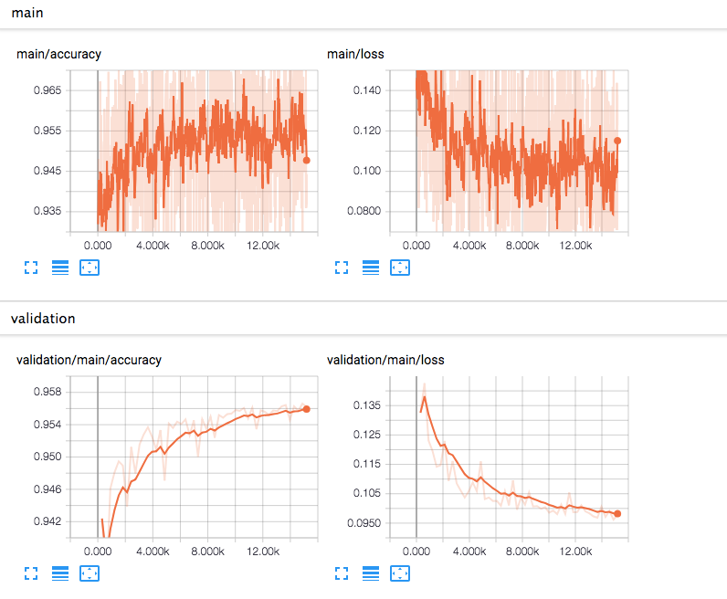
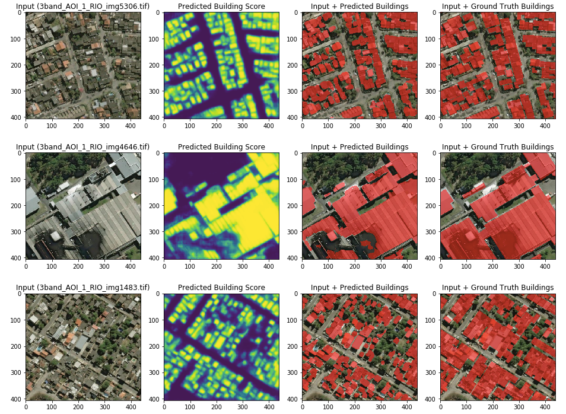
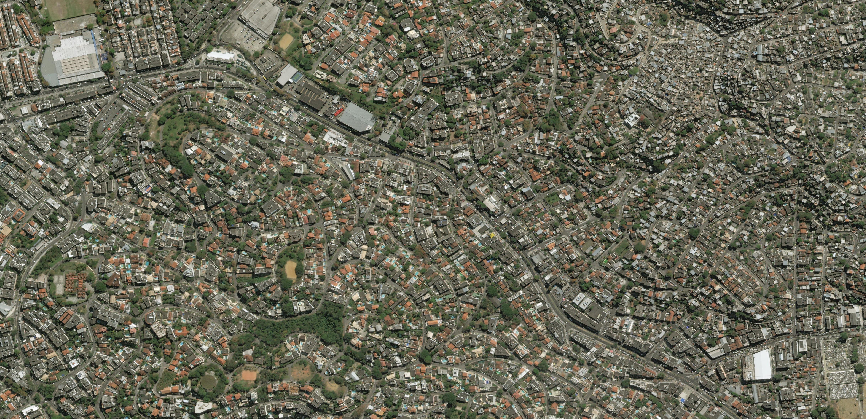
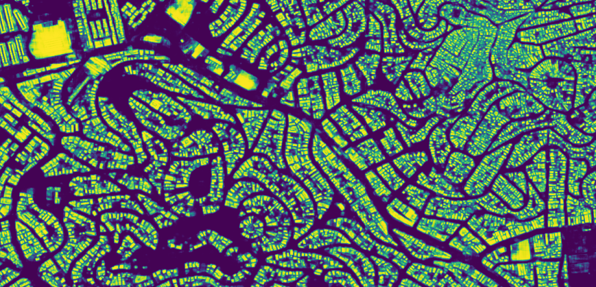

# SpaceNet Building Detection

This repository privides some python scripts and jupyter notebooks to train and evaluate convolutional neural networks 
which extract buildings from [SpaceNet](https://spacenetchallenge.github.io/) satellite images. 



## Dependency

* [NVIDIA Driver](https://www.nvidia.com/Download/index.aspx)
* [NVIDIA Docker](https://github.com/NVIDIA/nvidia-docker)
* [AWS CLI](https://docs.aws.amazon.com/streams/latest/dev/kinesis-tutorial-cli-installation.html)

## Usage

### 0. Clone this repo

```
$ PROJ_DIR=~/spacenet_building_detection  # assuming you clone this repo to your home directory

$ git clone --recursive https://github.com/motokimura/spacenet_building_detection.git $PROJ_DIR
```

### 1. Download SpaceNet dataset

Download satellite images and ground-truth building footprints (of SpaceNet AOI-1 Rio). 
Assuming you already configured [AWS CLI](https://docs.aws.amazon.com/streams/latest/dev/kinesis-tutorial-cli-installation.html) 
to download the data from AWS S3.

```
$ cd $PROJ_DIR/data

# Download processed 200mx200m tiles of AOI 1 (3.4 GB) with associated building footprints
$ aws s3api get-object --bucket spacenet-dataset --key AOI_1_Rio/processedData/processedBuildingLabels.tar.gz --request-payer requester processedBuildingLabels.tar.gz

$ tar -xvf processedBuildingLabels.tar.gz
$ cd processedBuildingLabels
$ tar -xvf 3band.tar.gz

$ cd vectordata 
$ tar -xvf geojson.tar.gz

# Download the Source Imagery Mosaic (3-band = 2.3 GB and 8-band = 6.5 GB)
$ cd $PROJ_DIR/data
$ aws s3api get-object --bucket spacenet-dataset --key AOI_1_Rio/srcData/rasterData/3-Band.tar.gz --request-payer requester 3-Band.tar.gz
$ tar -xvf 3-Band.tar.gz
```

You can find more details [here](https://spacenetchallenge.github.io/AOI_Lists/AOI_1_Rio.html).

### 2. Build Docker image

Build docker image to setup the environment to preprocess SpaceNet dataset and train/evaluate convolutional neural networks. 

```
$ cd $PROJ_DIR/docker
$ bash build.sh
```

I strongly reccomend you to use docker because you may have some troubles to install some geo-spatial data processing libraries. In case you don't want to use docker, you have to install additional dependencies described in [Dockerfile](docker/Dockerfile).

### 3. Preprocess SpaceNet dataset

Convert SpaceNet ground-truth building footprints from GeoJSON into building mask images.

Run docker container by following: 

```
$ cd $PROJ_DIR/docker
$ bash run.sh
```

Now you should be inside the docker container you ran. 
Convert SpaceNet dataset by following:

```
$(docker) cd /workspace/src/features
$(docker) python build_labels.py ../../data/processedBuildingLabels/3band ../../data/processedBuildingLabels/vectordata/geojson ../../data/buildingMaskImages
```

Now you will find many pairs of satellite images and building mask images 
in `$PROJ_DIR/data/processedBuildingLabels/3band` and `$PROJ_DIR/data/buildingMaskImages` respectively 
like below: 



### 4. Train U-Net

Train [U-Net](https://arxiv.org/abs/1505.04597), 
a convolutional neural network originaly developed for medical image segmentation.

Train U-Net with SpaceNet dataset by following:

```
$(docker) cd /workspace/src/models
$(docker) python train_model.py ../../data/dataSplit ../../data/processedBuildingLabels/3band ../../data/buildingMaskImages
```

You can check training status and validation accuracy from TensorBoard:

```
# Open another terminal window outside the container and type:
$ cd $PROJ_DIR/docker
$ bash exec.sh

# Now you should be inside the container already running. Start TensorBoard by following:
$(docker) tensorboard --logdir /workspace/models
```

Then, open `http://localhost:6006` from your browser.



### 5. Evaluate U-Net

Evaluate U-Net with jupyter notebook. 

Launch jupyter notebook by flollowing:

```
$(docker) cd /workspace/notebooks
$(docker) jupyter notebook
```

Then, open `http://localhost:8888` from your browser.

Default password is `passw0rd` as defined in [Dockerfile](https://github.com/motokimura/spacenet_building_detection/blob/1458d25ec15430629fe55a0b24f34230affaaeee/docker/Dockerfile#L65).

*Note that you may need to modify the path to pre-trained model defined in the notebooks below.*

#### 5.1 Quantitative evaluation

Open [this notebook](notebooks/models/evaluate_model.ipynb).

#### 5.2 Qualitative evaluation on test tile-images

Open [this notebook](notebooks/visualization/show_segmentation_on_test_tile.ipynb) 
to see segmentation results on tile images in test-plit.

Output examples:



#### 5.3 Qualitative evaluation on mosaic images

Open [this notebook](notebooks/visualization/show_segmentation_on_mosaic.ipynb) 
to see segmentation results on source mosaic images.

Output examples:





## License

[MIT License](LICENSE)
