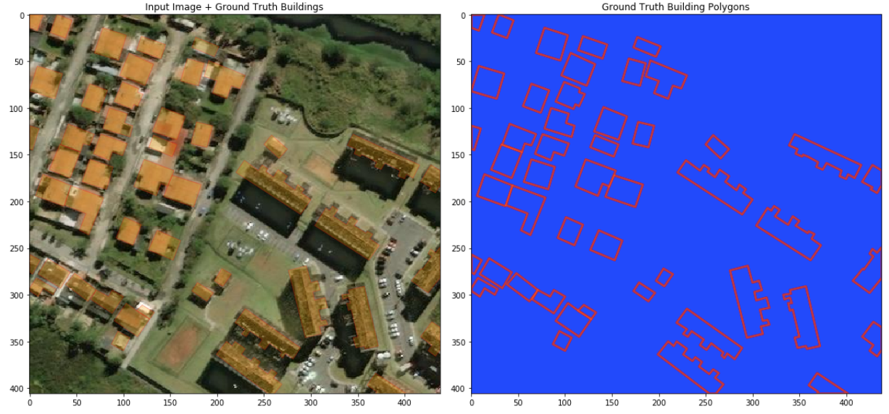

Some notebooks for the experiment to preprocess [SpaceNet](http://explore.digitalglobe.com/spacenet) satellite imagery data corpus to a format that is consumable by machine learning algorithms.

## Dependencies

- [GDAL](http://www.gdal.org/) (tested with 2.1.3)
- [libspatialindex](http://libspatialindex.github.io/) (tested with 1.8.5)
- Python packages listed in [requirements.txt](requirements.txt)

Recommed you to use [docker environment](../../docker).

## [Demo #1] Building footprints

Download instructions for the SpaceNet building footprint dataset can be 
found [here](https://spacenetchallenge.github.io).

### Building outline

See [plot_truth_coords.ipynb](plot_truth_coords.ipynb) for details.

### Building mask

See [plot_building_mask.ipynb](plot_building_mask.ipynb) for details.

### Building bounding box

*Comming soon..*